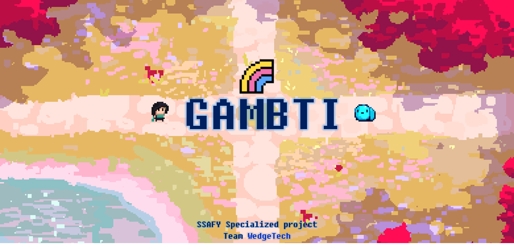
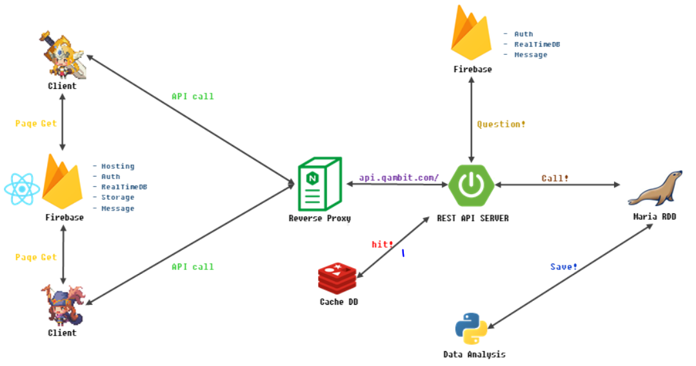

# GAMBTI

---

`GAME + MBTI : 사용자 MBTI 및 성향을 고려한 Steam 기반 게임 추천 서비스`

## **Index**

- [Architecture](#archiecture)
- [Tech Stack](#tech-stack)
- [Feature](#feature)

## **Architecture**

## **Tech Stack**

**Back-End**

- SpringBoot
- Spring Security
- JPA Hibernate
- MariaDB
- Firebase
- RedisDB
- Python

**Front-End**

- React
- material-ui
- HMTL
- CSS
- JavaScript

## **Feature**

### **주요 기능**

### **회원**

- 사용자 인증, 인가
  - 인증이 필요한 요청인 경우 Firebase에서 IdToken 유효성 검사
  - AuthenticationProvider 구현체에서 인증된 사용자의 권한 확인
- 로그인
  - Bearer Token 기반
- 회원가입
  - Firebase 메일 인증을 기반으로 함
- 비밀번호 변경
  - Firebase를 통해 사용자 재인증 후 비밀번호 변경
- 비밀번호 찾기
  - Firebase 메일 인증을 기반으로 비밀번호 찾기

### 게임 추천

- 게임 정보 확인
  - 스팀 게임에 대한 상세 정보 조회 가능
- 게임 추천
  - MBTI와 사용자 성향을 고려한 개인화 추천 제공

### 팀원 추천

- MBTI 별 궁합에 따른 팀원 자동 매칭

## 팀 소개
